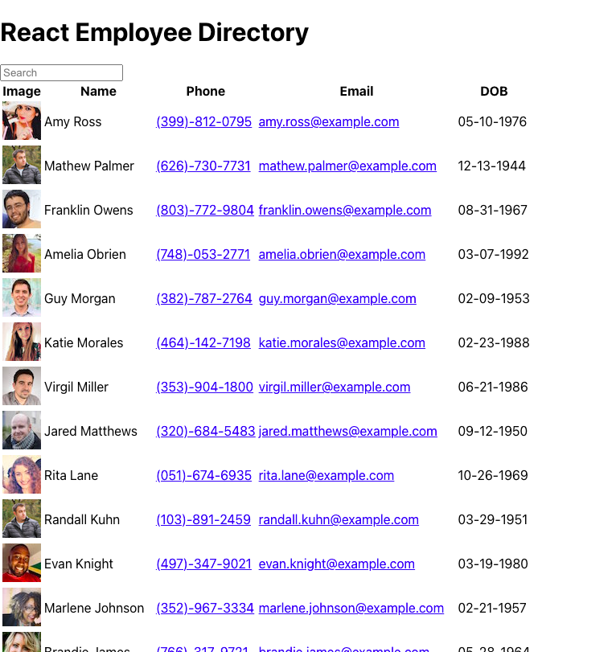

# React-Employee-Directory

## Table of contents
- [Description](#Description)
- [Installation](#Installation)
- [Usage](#Usage)
- [License](#License)
- [Technologies Used](#Technologies)
- [Contributors](#Contributors)
- [Tests](#Tests)
- [Repository Link](#Repository)
- [Deployed Link](#Deployed)
- [GitHub Info](#GitHub) 

## Description 
This React.js application utilizes an API call to populate random users and then create an employee directory. Users on the app can search for employees by "name" and also sort/organize employees by "name" in alphabetical or reverse alphabetical order.  

## Installation
Prerequisites to run the app: React.js and axios. Then clone the repository and run 'npm i' and 'npm start' in the command line.

## Usage
Fast and easy app to help a user find and sort employees by name and also see non-sensitive information about the employees.  

## License
ISC

## Technologies
React.js and axios

## Contributors
Stefan Podzinski 

## Tests
N/A

## Repository
https://github.com/stefanpodz303/React-Employee-Directory-App

## Deployed
https://react-employee-direc.herokuapp.com/

## GitHub
- stefanpodz303
- stefanpodz@yahoo.com
- https://stefanpodz303.github.io/Stefan-Podzinski-Portfolio/